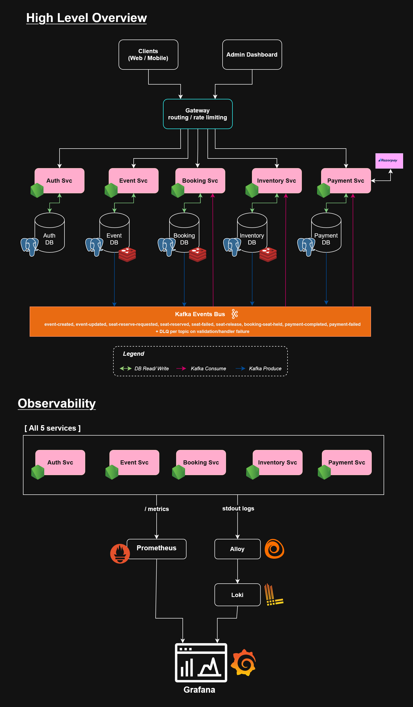

# Event Ticketing System

A distributed, event-driven ticketing platform designed to safely handle high-concurrency seat booking during sales without overselling. This system guarantees transaction correctness and eventual consistency across microservices using Postgres row-level locking, the transactional outbox pattern, and an asynchronous choreographic saga via Apache Kafka.

---

## Architecture Diagram



---

## Highlights & Engineering Decisions

- **Race-Condition Prevention:** Eliminates overselling under high traffic using PostgreSQL `FOR UPDATE SKIP LOCKED` to assign seats atomically across concurrent requests without lock contention.
- **Transactional Outbox Pattern:** Solves the dual-write problem by saving Kafka event payloads to an `outbox_events` table within the same database transaction as the business state change, ensuring at-least-once message delivery.
- **Choreographed Saga Architecture:** Coordinates distributed transactions across 5 isolated services (Auth, Event, Booking, Inventory, Payment) without a single point of failure or centralized orchestrator.
- **Production-Grade Observability:** Fully integrated telemetry pipeline utilizing structured JSON logging (Pino), Prometheus metrics registries, and Grafana Alloy log-routing into Loki to Grafana dashboards.
- **Isolated Data Ownership:** Strict adherence to microservice best practices, no shared databases and no cross-service SQL joins.

---

## Technology Stack

| Layer                   | Technology                                  |
| :---------------------- | :------------------------------------------ |
| **Runtime & Framework** | Node.js (v22) + TypeScript, Express         |
| **Data & ORM**          | PostgreSQL 16, Redis 7, Drizzle ORM         |
| **Messaging & Broker**  | Apache Kafka (KRaft mode)                   |
| **Infrastructure**      | Docker (multi-stage builds), Docker Compose |
| **Testing & CI**        | Vitest, Testcontainers, GitHub Actions      |
| **Observability**       | Prometheus, Grafana Alloy, Loki, Pino       |

---

## Quick Start (Local Development)

### Prerequisites

Ensure you have **Docker**, **Docker Compose**, and **pnpm** installed.

### 1. Configure Environment & Generate Keys

Generate an RSA keypair for JWT signing (RS256) at the repo root:

```bash
openssl genrsa -out private.pem 2048
openssl rsa -in private.pem -pubout -out public.pem
```

Then to convert the keys into a single line to paste into the env file run this at the root (or wherever .pem files were generated) run these in the terminal:

```bash
node -e "console.log(require('fs').readFileSync('private.pem', 'utf8').replace(/\n/g, '\\n'))"
```

```bash
node -e "console.log(require('fs').readFileSync('public.pem', 'utf8').replace(/\n/g, '\\n'))"
```

Copy the environment templates and fill in the generated key values (plus test-mode Razorpay keys for the payment service)

### 2. Spin Up Infrastructure

Start Kafka, Redis, five isolated Postgres databases, Kafka UI, the observability stack, and all 5 microservices in detached mode:

```bash
docker-compose up -d
```

### 3. Run Database Migrations

**Critical Requirement: You must apply the schema migrations across all databases before interacting with the services to avoid application crash loops**

```bash
pnpm run db:migrate
```

### 4. Run Services in Development Mode

To start all workspace apps concurrently with hot-reloading:
Bash

```bash
pnpm run dev --filter=*
```

### What's Running

| Service           | URL                   |
| :---------------- | :-------------------- |
| Auth Service      | http://localhost:4003 |
| Event Service     | http://localhost:4004 |
| Booking Service   | http://localhost:4005 |
| Inventory Service | http://localhost:4006 |
| Payment Service   | http://localhost:4007 |
| Kafka UI          | http://localhost:8080 |
| Prometheus        | http://localhost:9090 |
| Grafana           | http://localhost:3000 |

## Running Tests

Each service separates **unit tests** from **integration tests** (real Postgres via Testcontainers, requires Docker running).

### Run all unit tests across every service

```bash
pnpm test
```

### Run tests for a single service

```bash
pnpm --filter @ticketing/booking-service test              # unit tests
pnpm --filter @ticketing/booking-service test:integration   # integration tests (spins up a real Postgres container)
```

Replace `booking-service` with `auth-service`, `inventory-service`, or `payment-service` as needed.

> **Note:** `event-service` currently has typecheck coverage only, its test suite is a tracked gap (see [SYSTEM_DESIGN.md](docs/SYSTEM_DESIGN.md#19-future-steps)).

---

## Deep Dive & System Documentation

For full API specifications, Kafka contract definitions, data models, and Architecture Decision Records, check out the core system design file: [SYSTEM_DESIGN.md](docs/SYSTEM_DESIGN.md)
