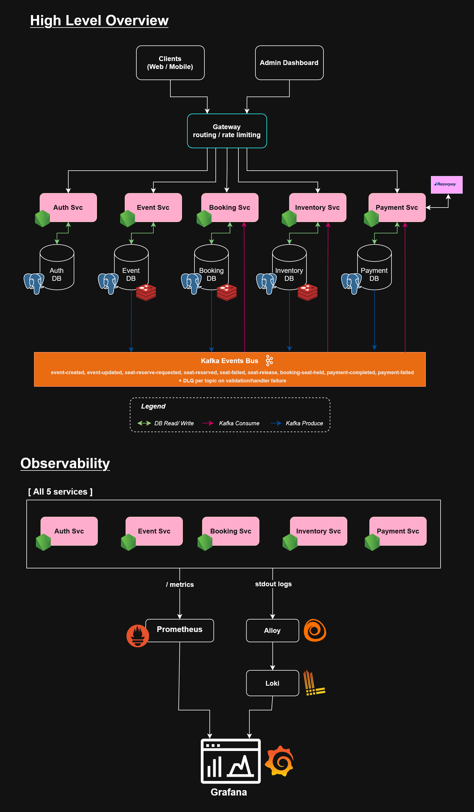

# Ticketing System - System Design Document

**Status:** V4
**Goal:** Learn system design/tradeoffs, microservices systems, DevOps concepts, observability/monitoring, following best practices
**Last updated:** 10th October, 2026.

---

## Table of Contents

1. [Project Overview](#1-project-overview)
2. [Goals and Non-Goals](#2-goals-and-non-goals)
3. [Scope](#3-scope)
4. [System Architecture](#4-system-architecture)
5. [Data Ownership](#5-data-ownership)
6. [Services Breakdown](#6-services-breakdown)
7. [Data Models](#7-data-models)
8. [Kafka Event Contracts](#8-kafka-event-contracts)
9. [Redis Usage](#9-redis-usage)
10. [Core Flows](#10-core-flows)
11. [Design Patterns](#11-design-patterns)
12. [API Reference](#12-api-reference)
13. [Local Development](#13-local-development)
14. [Infrastructure](#14-infrastructure)
15. [CI/CD: GitHub Actions](#15-cicd-github-actions)
16. [Observability](#16-observability)
17. [Load Testing](#17-load-testing)
18. [Architecture Decision Records](#18-architecture-decision-records)
19. [Future Steps](#19-future-steps)

---

## 1. Project Overview

**Ticketing System** is a ticket booking platform designed to safely handle high-concurrency booking of seats without overselling.

### Key problem being solved

During a flash sale, thousands of users simultaneously attempt to book the last few available seats. Without proper locking and event-driven coordination, the system would oversell - confirming more bookings than seats exist. This system prevents that using Postgres row-level locking and an async saga pattern via Kafka.

### Seat assignment model

For now, Users do not pick a specific seat. They request "X seats for event Y" and the system assigns the next available ones to them in order (example: User opens booking for 3 seats, they lock on to seat 11, seat 12, seat 13). The assigned seats is returned in the booking confirmation.

---

## 2. Goals and Non-Goals

### Goals

- Handle 1,000+ concurrent booking requests without overselling
- Guarantee eventual consistency across services
- Recover correctly from partial failures (service crash mid-saga, Outbox pattern is used for this )
- Structured observability - metrics and logs (Prometheus, Loki and Grafana)
- Keep the system simple (as much as possible lol) - every component must justify its existence

### Non-goals

- Not a full SaaS product: No multi-tenancy, or polished UI, No live RazorPay for now, just in test mode for now.
- No real-time seat map - users don't pick specific seats, they just pick quantity of seat that they want
- No email or SMS notifications for now
- No admin dashboard beyond basic REST APIs

---

## 3. Scope

- Auth + User Service
- Booking Service (core saga logic)
- Inventory Service (seat assignment + locking)
- Event Service (event creation + seat seeding)
- Payment Service (Razorpay test mode, completes full saga)
- Kafka (all inter-service communication)
- PostgreSQL (one database per service)
- Redis (idempotency, event cache, availability counter)
- Docker + Kubernetes (local with Kind)
- API Gateway (K8s Gateway API replacing legacy Ingress)
- CI/CD (GitHub Actions + Trivy image scanning + GHCR image publishing)
- GitOps CD (ArgoCD, syncs `k8s/` from `main`)
- Observability (kube-prometheus-stack, Grafana Alloy, Loki via Helm)

### To add later

- Notification Service
- Azure deployment (AKS) + Terraform. In progress: `infra/terraform/` provisions a VNet and node subnet as practice, the AKS cluster itself is next

---

## 4. System Architecture

### Diagram

<!-- markdownlint-disable-next-line MD033 -->


### Technology stack

| Concern          | Technology                  | Reason                                                                                     |
| ---------------- | --------------------------- | ------------------------------------------------------------------------------------------ |
| Runtime          | Node.js + TypeScript        | Async I/O suits event-driven architecture                                                  |
| Framework        | Express                     | Familiar, industry standard                                                                |
| ORM              | Drizzle ORM                 | Lightweight, type-safe, raw SQL access when needed                                         |
| Database         | PostgreSQL 16               | ACID guarantees, `FOR UPDATE SKIP LOCKED` row-level locking                                |
| Message broker   | Apache Kafka                | Durable, replayable, consumer group semantics                                              |
| Cache            | Redis 7                     | Fast in-memory ops, TTL support, atomic NX ops                                             |
| Containerisation | Docker (multi-stage builds) | Reproducible environments                                                                  |
| Orchestration    | Kubernetes via Kind         | Industry standard, horizontal scaling                                                      |
| CI/CD            | GitHub Actions              | Integrated with repo                                                                       |
| GitOps / CD      | ArgoCD                      | TODO                                                                                       |
| Image scanning   | Trivy                       | TODO                                                                                       |
| IaC              | Terraform (`azurerm`)       | TODO                                                                                       |
| Logging          | Pino                        | Structured JSON logging for traceability                                                   |
| Load testing     | k6                          | Scriptable, handles 1000+ virtual users                                                    |
| Monitoring       | Grafana                     | cost effective, centralized monitoring, customizeable                                      |
| Metrics          | Prometheus                  | Native Insights into Node.js Internals, custom metrics                                     |
| Log collection   | Loki + Alloy                | Maximizes Node.js Event Loop Performance, Dynamic Labeling, Handles pino's json logs great |

---

## 5. Data Ownership

> No shared databases. No cross-service joins. Ever.

| Entity   | Owner Service     | How other services access it                              |
| -------- | ----------------- | --------------------------------------------------------- |
| Users    | Auth Service      | Other services read `userId` from the decoded JWT         |
| Events   | Event Service     | Booking Service caches event metadata via `event.created` |
| Seats    | Inventory Service | Seeded by consuming `event.created` - no direct access    |
| Bookings | Booking Service   | Inventory only knows `bookingId` as a plain reference     |
| Payments | Payment Service   | Payment uses `bookingId` to create order                  |

---

## 6. Services Breakdown

### 6.1 Auth + User Service

**Responsibility:** Authentication and user identity

**Handles:**

- User registration and login
- JWT access token issuance (15-min expiry)
- Refresh token management (7-day expiry)
- User profile CRUD

**Produces (Kafka):** nothing
**Consumes (Kafka):** nothing

**Note:** No service calls Auth at runtime. The JWT is verified locally using the shared public key.

---

### 6.2 Event Service

**Responsibility:** Admin-facing event management

**Handles:**

- Create, update, and cancel events
- Emit Kafka events so downstream services can react

**Produces (Kafka):**

- `event-created` - when admin creates a new event
- `event-updated` - when admin changes price, seat count, or status

**Consumes (Kafka):**

> only publishes event data.
> Inventory Service creates seat rows in its own DB by reacting to `event-created`.

---

### 6.3 Inventory Service

**Responsibility:** Source of truth for seat availability and assignment

**Handles:**

- Seeding seat rows when a new event is created
- Assigning an available seat using `FOR UPDATE SKIP LOCKED`
- Emitting reservation success or failure back to Booking Service

**Produces (Kafka):**

- `seat-reserved` - seat successfully assigned to a booking
- `seat-failed` - no seats available

**Consumes (Kafka):**

- `event-created` - bulk inserts seat rows, sets Redis availability counter
- `seat-reserve-requested` - picks and locks an available seat

- `seat-release` - releases locked (held seats) when payment fails
- `payment-completed` - mark seats as booked when payment succeeds

**Locking strategy:**

```TypeScript
const rows = await tx
    .select()
     .from(seats)
    .where(and(eq(seats.eventId, eventId), eq(seats.status, "available")))
    .orderBy(seats.seatIndex)
    .limit(quantity)
    .for("update", { skipLocked: true });

-- Drizzle Native query
-- SKIP LOCKED: skip seats currently contested by other transactions.
-- Each concurrent request gets a different seat rather than queuing on one.
```

**Why `SKIP LOCKED`**  
In very high traffic conditions, users all request "any available seat." `SKIP LOCKED` spreads those requests across all available seats. Each transaction takes a different seat instead of everyone fighting over seat 1. Once all seats are held, queries return empty and `seat.failed` is emitted.

---

### 6.4 Booking Service

**Responsibility:** Core business logic and saga coordination

**Handles:**

- Booking creation - validates event exists via Redis cache
- Publishing `seat-reserve-requested` via the outbox pattern
- Reacting to inventory outcomes and updating booking status
- Idempotency enforcement, prevents duplicate bookings

**Produces (Kafka):**

- `seat-reserve-requested` - published via outbox poller

**Consumes (Kafka):**

- `event-created` - caches event metadata in Redis for local validation
- `event-updated` - conditionally replaces event metadata in Redis by version
- `seat-reserved` - transitions booking to `held`
- `seat-failed` - transitions booking to `failed`
- `payment-completed` - transitions booking to `completed`
- `payment-failed` - transitions booking to failed

**Booking state machine:**

```TypeScript
pending -> seat_held -> payment_initiated -> confirmed   (terminal success)
-> failed                                         (terminal failure - no seats, payment declined, or hold expired)
confirmed -> cancelled  (future phase - user-initiated cancellation)
```

### 6.5 Payment Service

**Responsibility:** Payment processing and the final saga step that converts a seat hold into a confirmed booking.

**Handles:**

- Maintains a local `holds` read-model, populated entirely from Kafka (`booking-seat-held`)
- Creates Razorpay orders on demand (`POST /payments/orders`)
- Verifies payment via two independent paths:
  1. **Client-driven verification** (`POST /payments/verify`) HMAC-SHA256 signature check against `orderId|paymentId`
  2. **Razorpay webhook** (`POST /payments/webhook`) signed with a separate webhook secret, verified against the raw request body
- Runs a background **hold expiry job** (every 30s) that fails any `pending` hold past its `expiresAt`, emitting `payment-failed` with `reason: "hold_expired"`, this is what unsticks a booking if the user simply abandons checkout.

**Produces (Kafka):**

- `payment-completed`- signature verified AND hold was in `pending` state
- `payment-failed`- signature invalid, hold expired, or webhook reports decline

**Consumes (Kafka):**

- `booking-seat-held`- populates local `holds` table (own DB, own source of truth for hold state)

**Why signature verification alone isn't the correctness mechanism:**

A cryptographically valid Razorpay signature proves the payment payload wasn't tampered with, it does **not** prove the payment should be applied to this booking right now (e.g. a replayed webhook, or a hold that already expired). The real guard is an atomic conditional update:

If zero rows come back, the payment is a no-op (duplicate webhook, already-failed hold, etc.) this is what makes `completeCapturedPayment` safe under Razorpay's documented at-least-once webhook redelivery, verified directly by the concurrent-duplicate-webhook integration test.

**Why two verification paths (client + webhook) instead of one:**

|              | Client-driven `/verify`                                            | Webhook                                           |
| ------------ | ------------------------------------------------------------------ | ------------------------------------------------- |
| Speed        | Immediate user sees confirmation right after `rzp.open()` succeeds | Delayed by Razorpay's own retry/delivery schedule |
| Trust        | Client browser is untrusted input                                  | Razorpay's server is the source of truth          |
| Failure mode | Browser closes/crashes before verify call fires → booking stuck    | Always eventually arrives durability net          |

Running both means the client path gives a fast UX, and the webhook is the durability backstop if the client never calls back. The `WHERE status = 'pending'` guard makes it safe for both to race, whichever arrives first wins, the second is a no-op.

---

## 7. Data Models

### Auth Service - `users`

```sql
CREATE TABLE users (
  id            UUID PRIMARY KEY DEFAULT gen_random_uuid(),
  email         TEXT NOT NULL UNIQUE,
  password_hash TEXT NOT NULL,
  role          TEXT NOT NULL DEFAULT 'user',
  created_at    TIMESTAMPTZ NOT NULL DEFAULT NOW()
);

CREATE TABLE refresh_tokens (
  id         UUID PRIMARY KEY DEFAULT gen_random_uuid(),
  user_id    UUID NOT NULL REFERENCES users(id) ON DELETE CASCADE,
  token_hash TEXT NOT NULL UNIQUE,
  expires_at TIMESTAMPTZ NOT NULL,
  created_at TIMESTAMPTZ NOT NULL DEFAULT NOW()
);
```

---

### Event Service - `events`

```sql
CREATE TABLE events (
  id             UUID PRIMARY KEY DEFAULT gen_random_uuid(),
  title          TEXT NOT NULL,
  venue          TEXT NOT NULL,
  event_date     TIMESTAMPTZ NOT NULL,
  total_seats    INTEGER NOT NULL,
  price          INTEGER NOT NULL,
  sale_starts_at TIMESTAMPTZ,
  status         TEXT NOT NULL DEFAULT 'draft',
  created_at     TIMESTAMPTZ NOT NULL DEFAULT NOW(),
  updated_at     TIMESTAMPTZ NOT NULL DEFAULT NOW()
);
```

---

### Inventory Service - `seats`

```sql
CREATE TABLE seats (
  id          UUID PRIMARY KEY DEFAULT gen_random_uuid(),
  event_id    UUID NOT NULL,
  seat_number TEXT NOT NULL,
  status      TEXT NOT NULL DEFAULT 'available',
  held_by     UUID,
  created_at  TIMESTAMPTZ NOT NULL DEFAULT NOW(),
  UNIQUE (event_id, seat_number)
);

CREATE INDEX idx_seats_event_available
  ON seats (event_id, seat_number)
  WHERE status = 'available';
```

---

### Booking Service - `bookings`

```sql
CREATE TABLE bookings (
  id              UUID PRIMARY KEY DEFAULT gen_random_uuid(),
  user_id         UUID NOT NULL,
  event_id        UUID NOT NULL,
  seat_id         UUID,
  status          TEXT NOT NULL DEFAULT 'pending',
  amount          INTEGER NOT NULL,
  idempotency_key TEXT UNIQUE,
  created_at      TIMESTAMPTZ NOT NULL DEFAULT NOW(),
  updated_at      TIMESTAMPTZ NOT NULL DEFAULT NOW()
);
```

### Booking Service - `outbox_events`

```sql
CREATE TABLE outbox_events (
  id        UUID PRIMARY KEY DEFAULT gen_random_uuid(),
  topic     TEXT NOT NULL,
  payload   JSONB NOT NULL,
  published BOOLEAN NOT NULL DEFAULT FALSE,
  created_at TIMESTAMPTZ NOT NULL DEFAULT NOW()
);


CREATE INDEX idx_outbox_unpublished
  ON outbox_events (created_at)
  WHERE published = FALSE;
```

### Payment Service - `holds`

```sql
CREATE TABLE holds (
  booking_id        TEXT PRIMARY KEY,
  user_id           TEXT NOT NULL,
  event_id          TEXT NOT NULL,
  seat_ids          JSONB NOT NULL,
  seat_numbers      JSONB NOT NULL,
  amount            INTEGER NOT NULL,
  razorpay_order_id TEXT,
  expires_at        TIMESTAMPTZ NOT NULL,
  status            TEXT NOT NULL DEFAULT 'pending',  -- pending | completed | failed
  created_at        TIMESTAMPTZ NOT NULL DEFAULT NOW(),
  updated_at        TIMESTAMPTZ NOT NULL DEFAULT NOW()
);
```

### All Kafka-consuming services - `processed_events`

Each service that consumes Kafka events has its own copy:

```sql
CREATE TABLE processed_events (
  message_id   TEXT PRIMARY KEY,
  topic        TEXT NOT NULL,
  processed_at TIMESTAMPTZ NOT NULL DEFAULT NOW()
);
```

## 8. Kafka Event Contracts

All payloads are defined as Zod schemas in `packages/kafka-client/src/scehmas.ts`. Producers get a compile-time error for malformed payloads. Consumers get a runtime validation error and route to a Dead Letter Queue (`{topic}.dlq`).

Topic names are defined once in `packages/kafka-client/src/topics.ts`:

```typescript
export const TOPICS = {
  EVENT_CREATED: "event-created",
  EVENT_UPDATED: "event-updated",

  SEAT_RESERVE_REQUESTED: "seat-reserve-requested",
  SEAT_RESERVED: "seat-reserved",
  SEAT_FAILED: "seat-failed",
  SEAT_RELEASE: "seat-release",

  BOOKING_SEAT_HELD: "booking-seat-held",

  PAYMENT_COMPLETED: "payment-completed",
  PAYMENT_FAILED: "payment-failed",
} as const;
```

> Naming convention: hyphenated, present/past-tense verb last (`seat-reserved`, not `seat.reserved`). This doc previously used dot-notation (`event.created`) as shorthand — that was never the actual Kafka topic string. All references below use the real topic string.

---

### `event-created`

**Producer:** Event Service **Consumers:** Inventory Service, Booking Service

```typescript
{
  messageId: string;
  eventId: string;
  version: number;
  title: string;
  totalSeats: number;
  price: number;          // paise
  eventDate: string;       // ISO datetime
  status: "active" | "draft";
  saleStartsAt?: string | null; // ISO date, nullable
}

```

---

### `event-updated`

**Producer:** Event Service **Consumer:** Booking Service

```typescript
{
  messageId: string;
  eventId: string;
  version: number;
  title: string;
  totalSeats: number;
  price: number; // paise
  eventDate: string; // ISO datetime
  status: "active" | "draft" | "cancelled";
  saleStartsAt: string | null;
}
```

---

### `seat-reserve-requested`

**Producer:** Booking Service (via outbox) **Consumer:** Inventory Service

```typescript
{
  messageId: string;
  bookingId: string;
  userId: string;
  eventId: string;
  quantity: number; // 1-6, multi-seat booking
  requestedAt: string;
}
```

> No `seatId` here. The client doesn't choose seats — only a quantity. Inventory picks `quantity` seats atomically. `seatIds` only appears in `seat-reserved`.

---

### `seat-reserved`

**Producer:** Inventory Service **Consumer:** Booking Service

```typescript
{
  messageId: string;
  bookingId: string;
  seatIds: string[];       // array — one per seat in the booking
  seatNumbers: string[];
  reservedAt: string;
}

```

---

### `seat-failed`

**Producer:** Inventory Service **Consumer:** Booking Service

```typescript
{
  messageId: string;
  bookingId: string;
  reason: "no_seats_available" | "event_not_found" | "insufficient_seats";
}
```

> `insufficient_seats` is distinct from `no_seats_available`: it fires when _some_ but not all of the requested `quantity` are free. Seat assignment is all-or-nothing per booking — Inventory never partially fulfils a multi-seat request.

---

### `seat-release`

**Producer:** Booking Service (via outbox — compensating action) **Consumer:** Inventory Service

```typescript
{
  messageId: string;
  bookingId: string;
  eventId: string;
  seatIds: string[];
}

```

> Fired when a booking that already holds seats fails downstream (payment declined, hold expired, signature mismatch). Inventory releases the seats back to `available` and restores the Redis availability counter. This is the saga's rollback path.

---

### `booking-seat-held`

**Producer:** Booking Service (via outbox) **Consumer:** Payment Service

```typescript
{
  messageId: string;
  bookingId: string;
  userId: string;
  eventId: string;
  seatIds: string[];
  seatNumbers: string[];
  amount: number;           // paise, total for all seats
  expiresAt: string;
}

```

> This is how Payment Service learns a hold exists without any HTTP call. It populates its own `holds` table purely from this event — the same cache-aside-without-a-cache pattern Booking Service uses for event data.

---

### `payment-completed`

**Producer:** Payment Service **Consumers:** Booking Service, Inventory Service

```typescript
{
  messageId: string;
  bookingId: string;
  razorpayPaymentId: string;
  razorpayOrderId: string;
  amount: number;
  paidAt: string;
}
```

> Booking Service transitions the booking to `confirmed`. Inventory Service transitions the held seats to `booked` (terminal) — the seat lifecycle only closes once payment is actually captured, not at the point of holding.

---

### `payment-failed`

**Producer:** Payment Service **Consumer:** Booking Service

```typescript
{
  messageId: string;
  bookingId: string;
  reason: "payment_declined" |
    "payment_cancelled" |
    "hold_expired" |
    "signature_mismatch";
  failedAt: string;
}
```

> Booking Service transitions the booking to `failed` and, if the booking had held seats (`seatIds` populated), emits `seat-release` as a compensating action.

---

## 9. Redis Usage

Redis is never the source of truth. Postgres always is.
Redis is a performance layer only.

| Key pattern                 | Owner             | Strategy      | TTL   | Purpose                                          |
| --------------------------- | ----------------- | ------------- | ----- | ------------------------------------------------ |
| `event:{eventId}`           | Booking Service   | Cache-aside   | 1 hr  | Validate event locally without calling Event Svc |
| `idempotency:{key}`         | Booking Service   | NX flag       | 24 hr | Prevent duplicate booking submissions            |
| `seats:available:{eventId}` | Inventory Service | Write-through | none  | Fast availability display                        |

### Cache-aside - event metadata

```typescript
// Booking Service consumes event.created:
await redis.set(`event:${eventId}`, JSON.stringify(payload), "EX", 3600);

// At booking request time - no HTTP call to Event Service:
const cached = await redis.get(`event:${eventId}`);
if (!cached) throw new EventNotFoundError(eventId);
const event = JSON.parse(cached);

// Validate sale window
if (new Date() < new Date(event.saleStartsAt)) {
  throw new SaleNotOpenError();
}
```

### Versioned updates on event.updated

```typescript
// Booking Service consumes event.updated:
// Atomically replace only when payload.version is newer than the cached version.
// Cancelled snapshots are retained briefly as tombstones, so delayed older
// active snapshots cannot recreate a bookable cache entry.
await eventCache.set(payload);
```

### Idempotency

```typescript
const key = `idempotency:${idempotencyKey}`;
const set = await redis.set(key, bookingId, "NX", "EX", 86400);
if (!set) {
  // Already processed - return the original booking
  return getBookingById(existingBookingId);
}
```

## 10. Core Flows

### 10.1 Successful booking

```text
1. Client -> POST /bookings
   Body: { eventId, quantity }        <- no seatIds, user picks quantity only
   Headers: Idempotency-Key: <uuid>

2. Booking Service:
   - GET idempotency:{key} from Redis -> not found, proceed
   - GET event:{eventId} from Redis -> validate event is active + sale is open
   - BEGIN TRANSACTION
       INSERT INTO bookings (status='pending', quantity, amount=event.price*quantity)
       INSERT INTO outbox_events (topic='seat-reserve-requested',
         payload={ messageId, bookingId, userId, eventId, quantity })
     COMMIT
   - SET idempotency:{key} = bookingId EX 86400
   - Return 202 Accepted { bookingId }

3. Outbox poller (every ~500ms):
   SELECT FROM outbox_events WHERE published = FALSE
   FOR UPDATE SKIP LOCKED LIMIT 100
   -> Publishes seat-reserve-requested to Kafka
   -> UPDATE outbox_events SET published = TRUE

4. Inventory Service consumes seat-reserve-requested:
   - SELECT message_id FROM processed_events -> not found
   - BEGIN TRANSACTION
       SELECT id, seat_number FROM seats
       WHERE event_id = $eventId AND status = 'available'
       ORDER BY seat_index
       LIMIT $quantity
       FOR UPDATE SKIP LOCKED
       -> quantity rows returned (or fewer)

       -- All-or-nothing: if fewer than `quantity` rows returned, roll back
       -- and emit seat-failed instead of holding a partial set.

       UPDATE seats SET status = 'held', held_by = $bookingId
       WHERE id = ANY($seatIds)

       INSERT INTO processed_events (message_id, topic)
     COMMIT
   - DECR seats:available:{eventId} by quantity in Redis
   - Publish seat-reserved { bookingId, seatIds, seatNumbers }

5. Booking Service consumes seat-reserved:
   - SELECT message_id FROM processed_events -> not found
   - BEGIN TRANSACTION
       UPDATE bookings SET status = 'seat_held', seat_ids = $seatIds, seat_numbers = $seatNumbers
       INSERT INTO outbox_events (topic='booking-seat-held',
         payload={ messageId, bookingId, userId, eventId, seatIds, seatNumbers, amount, expiresAt: now()+30min })
       INSERT INTO processed_events (message_id, topic)
     COMMIT
   - Cache updated booking in Redis

6. Payment Service consumes booking-seat-held:
   - INSERT/UPDATE INTO holds (booking_id, ..., status='pending', expires_at)
   - INSERT INTO processed_events

7. Client -> POST /payments/orders { bookingId }
   Payment Service:
   - Validates hold exists, is 'pending', not expired
   - Creates Razorpay order, stores razorpay_order_id
   - Returns { orderId, amount, currency, keyId }

8. Client completes payment via Razorpay Checkout, then either:
   (a) POST /payments/verify { bookingId, razorpayOrderId, razorpayPaymentId, razorpaySignature }
       -> HMAC-SHA256 signature check -> atomic UPDATE holds SET status='completed' WHERE status='pending'
   (b) Razorpay webhook POST /payments/webhook (durability backstop, may arrive first or second)
       -> same atomic guard, so whichever arrives first wins; the second is a no-op

   On success, Payment Service:
   - INSERT INTO outbox_events (topic='payment-completed', payload={ bookingId, razorpayPaymentId, amount, paidAt })

9. Booking Service consumes payment-completed:
   - UPDATE bookings SET status = 'confirmed'

   Inventory Service consumes payment-completed:
   - UPDATE seats SET status = 'booked' WHERE held_by = $bookingId AND status = 'held'

10. User polls -> GET /bookings/{bookingId}
   Response: { status: 'confirmed', seatNumbers: ['Seat 11', 'Seat 12', 'Seat 13'] }

```

---

### 10.2 Failed booking: no seats available

```text
Steps 1->3 identical.

4. Inventory Service consumes seat-reserve-requested:
   - SELECT FROM processed_events -> not found
   - BEGIN TRANSACTION
       SELECT id FROM seats
       WHERE event_id = $eventId AND status = 'available'
       LIMIT $quantity FOR UPDATE SKIP LOCKED
       -> fewer than $quantity rows returned
     COMMIT (nothing updated — all-or-nothing)
   - Publish seat-failed { bookingId, reason: quantity > 1 ? 'insufficient_seats' : 'no_seats_available' }

5. Booking Service consumes seat-failed:
   - UPDATE bookings SET status = 'failed'

6. User polls -> GET /bookings/{bookingId}
   Response: { status: 'failed', reason: 'no_seats_available' }

```

---

### 10.3 Failed booking payment declined or hold expired (compensation flow)

```text
Steps 1->6 identical to 10.1 (booking reaches seat_held, hold created in Payment Service).

7. Either:
   (a) Payment fails signature verification, or Razorpay reports payment.failed, or
   (b) The 30s hold-expiry job in Payment Service finds a pending hold past expiresAt

   Payment Service:
   - Atomic UPDATE holds SET status='failed' WHERE status='pending' (guards against
     racing with a genuine success)
   - Publish payment-failed { bookingId, reason }

8. Booking Service consumes payment-failed:
   - BEGIN TRANSACTION
       UPDATE bookings SET status = 'failed'
       -- booking.seatIds is populated (it reached seat_held) -> compensate:
       INSERT INTO outbox_events (topic='seat-release',
         payload={ messageId, bookingId, eventId, seatIds })
       INSERT INTO processed_events
     COMMIT
9. Inventory Service consumes seat-release:
   - UPDATE seats SET status='available', held_by=NULL
     WHERE id = ANY($seatIds) AND held_by=$bookingId AND status='held'
   - INCR seats:available:{eventId} by released count in Redis

10. User polls -> GET /bookings/{bookingId}
   Response: { status: 'failed', reason: 'hold_expired' | 'payment_declined' | 'signature_mismatch' }

```

---

### 10.4 Event creation: seeding seats in Inventory

```text
1. Admin -> POST /events { title, totalSeats: 200, price: 50000, saleStartsAt, ... }

2. Event Service:
   BEGIN TRANSACTION
     INSERT INTO events (...)
     INSERT INTO outbox_events (topic='event-created',
       payload={ eventId, title, totalSeats: 200, price: 50000, saleStartsAt, ... })
   COMMIT
   Return 201 Created { eventId }

3. Outbox poller publishes event-created to Kafka.

4. Inventory Service consumes event-created:
   - Check processed_events -> not found
   - Bulk insert 200 seat rows with seat_index 1..200:
     INSERT INTO seats (event_id, seat_number, seat_index, status)
     SELECT $eventId, 'Seat ' || gs, gs, 'available'
     FROM generate_series(1, 200) gs
   - SET seats:available:{eventId} = 200 in Redis
   - INSERT INTO processed_events

5. Booking Service consumes event-created:
   - Check processed_events -> not found
   - Cache event in Redis (TTL by status)
   - INSERT INTO processed_events

After step 5.: Booking Service can validate any booking for this event
using the Redis cache - zero calls to Event Service at runtime.

```

---

## 11. Design Patterns

### 11.1 Outbox pattern

**Problem:** Writing to Postgres and publishing to Kafka are two operations. A crash between them leaves the system in a corrupt state - a booking exists with no Kafka event, or vice versa.

**Solution:** Write the Kafka payload to an `outbox_events` table inside the same DB transaction as the booking. A poller process publishes the rows and marks them done.

```typescript
await db.transaction(async (tx) => {
  const [booking] = await tx
    .insert(bookings)
    .values({ userId, eventId, status: "pending", amount })
    .returning();

  await tx.insert(outbox_events).values({
    topic: "seat.reserve_requested",
    payload: {
      messageId: crypto.randomUUID(),
      bookingId: booking.id,
      userId,
      eventId,
      requestedAt: new Date().toISOString(),
    },
  });

  return booking;
});
```

**Poller - why `SKIP LOCKED` matters here too:**

```sql
SELECT * FROM outbox_events
WHERE published = FALSE
ORDER BY created_at
FOR UPDATE SKIP LOCKED   -- multiple poller replicas don't block each other
LIMIT 100;
```

Without `SKIP LOCKED`, two Booking Service replicas would queue up on the same rows. With it, each replica takes a different batch and processes in parallel.

---

### 11.2 Saga pattern

No central orchestrator. Services react to each other's Kafka events.

```text
Booking -> seat-reserve-requested -> Inventory
                                        |
                           +-----------+----------+
                           v                      v
                      seat-reserved           seat-failed
                           |                      |
                           v                      v
                Booking -> seat_held    Booking -> failed (terminal)
                           |
                           v
                 booking-seat-held -> Payment
                                        |
                           +-----------+----------+
                           v                      v
                    payment-completed     payment-failed
                           |                      |
                           v                      v
              Booking -> confirmed        Booking -> failed
              Inventory: seats -> booked         |
                                                  v
                                     Booking emits seat-release
                                     (only if seatIds were held)
                                                  |
                                                  v
                                     Inventory: seats -> available

```

The saga is complete when Booking reaches a terminal state (`confirmed` or `failed`). If it fails **before** `seat_held` (i.e. at `seat-failed`), Inventory never committed a seat change no compensation needed. If it fails **after** `seat_held` (payment declined/expired), Inventory already holds seats and the `seat-release` compensating event is required to undo that.

---

### 11.3 HTTP request idempotency

Prevents duplicate bookings from client retries (network timeout, double-tap):

```typescript
const key = `idempotency:${req.headers["idempotency-key"]}`;
const existing = await redis.get(key);
if (existing) {
  const booking = await db.query.bookings.findFirst({
    where: eq(bookings.id, existing),
  });
  return reply.status(200).send(booking);
}
// Not seen - process and cache result
```

---

### 11.4 Kafka consumer idempotency

Kafka guarantees at-least-once delivery. A consumer can receive the same message more than once after a crash or rebalance. Without idempotency, Inventory Service could assign two seats for the same booking.

Every consumer checks `processed_events` before acting:

```typescript
async function handleSeatReserveRequested(msg: SeatReserveRequestedEvent) {
  const seen = await db.query.processed_events.findFirst({
    where: eq(processed_events.message_id, msg.messageId),
  });
  if (seen) return; // already handled - ack and skip

  await db.transaction(async (tx) => {
    // ... assign seat, update status ...

    // Mark processed inside the same transaction
    await tx.insert(processed_events).values({
      message_id: msg.messageId,
      topic: "seat.reserve_requested",
    });
  });
}
```

The insert into `processed_events` is inside the same transaction as the business logic. If the transaction rolls back, the record is also rolled back - the message will be retried correctly next time.

### 11.5 Outbox / processed_events retention (batched cleanup)

**Problem:** `outbox_events` and `processed_events` are append-only by
design so every booking, seat assignment, and payment writes at least one
row. Neither table is ever pruned by the hot path, so both grow without
bound. Confirmed directly during load testing: these tables reached
millions of rows across repeated k6 runs.

**Solution:** A shared batched-delete helper
(`packages/db/src/cleanup.ts`) is invoked by a small `cleanup.ts` entrypoint
per service, run on a schedule via a Kubernetes CronJob, one per service,
since each owns its own database.

```typescript
await batchDeleteOlderThan(db, {
  table: outboxEvents,
  idColumn: outboxEvents.id,
  timestampColumn: outboxEvents.createdAt,
  cutoff: daysAgo(OUTBOX_RETENTION_DAYS),
  extraCondition: eq(outboxEvents.published, true),
  label: "outbox_events",
});
```

**Why batched, not a single `DELETE ... WHERE created_at < $cutoff`:**
An unbatched delete against a multi-million-row table holds a long-lived
lock, produces a large WAL burst, and creates autovacuum pressure - all of
which can degrade the outbox poller running concurrently against the same
table. The cleanup helper instead deletes in bounded batches (default
5,000 rows), sleeping briefly (`delayMs`, default 100ms) between batches
so autovacuum and any replicas can keep up, looping until a partial batch
confirms no eligible rows remain.

**Why a subquery-based delete:** PostgreSQL's `DELETE` doesn't support
`ORDER BY` or `LIMIT`. To delete the oldest N rows in one round trip
without pulling IDs into application memory first, the helper compiles to:

```sql
DELETE FROM outbox_events
WHERE id IN (
  SELECT id FROM outbox_events
  WHERE published = true AND created_at < $cutoff
  ORDER BY created_at
  LIMIT 5000
)
```

**Per-service retention targets:**

| Service             | Cleans                                          | Default retention |
| ------------------- | ----------------------------------------------- | ----------------- |
| `booking-service`   | `outbox_events` (published), `processed_events` | 7d / 14d          |
| `event-service`     | `outbox_events` (published)                     | 7d                |
| `inventory-service` | `processed_events`                              | 14d               |
| `payment-service`   | `outbox_events` (published), `processed_events` | 7d / 14d          |

`event-service` has no `processed_events` table since it doesn't consume
any Kafka topics. `inventory-service` publishes directly via the Kafka
producer rather than the outbox pattern, so it has no `outbox_events`
table.

**Kubernetes CronJob configuration:**

- `concurrencyPolicy: Forbid`: prevents an overrunning cleanup job from
  overlapping with the next scheduled run against the same table.

- `backoffLimit: 2` : cleanup is naturally idempotent (a retried run just
  deletes whatever's still past the cutoff), so retrying on transient DB
  errors is safe.

- Schedules staggered 5 minutes apart per service : not required for
  correctness (each service owns a separate database), but avoids all
  four cleanup jobs competing for the same node's CPU on a local Kind
  cluster.

Manifests: `k8s/*/cleanup-cronjob.yaml`.

---

## 12. API Reference

### Auth endpoints

```text
POST  /auth/register    Register new user
POST  /auth/login       Login - returns access token + refresh token (httpOnly cookie)
POST  /auth/logout      Revoke current session
POST  /auth/refresh     Exchange refresh token for new access token
GET   /auth/me          Get current user profile

```

### Event endpoints

```text
GET   /events           List all active events
GET   /events/:id       Get event details
POST  /events           [admin] Create event
PATCH /events/:id       [admin] Update event

```

### Booking endpoints

```text
POST  /bookings         Create a booking - returns 202 + bookingId
                         Body: { eventId, quantity }   (quantity: 1-6, default 1)
                         Header: Idempotency-Key: <uuid>  [required]

GET   /bookings/:id     Get booking status + assigned seats
GET   /bookings/        Get current user's bookings

```

### Payment endpoints

```text
POST  /payments/orders   Create (or return existing) Razorpay order for a booking
                          Body: { bookingId }
                          Auth required. 404 if no hold, 403 if not owner,
                          409 if hold already settled, 410 if hold expired.

POST  /payments/verify   Client-driven verification after Razorpay Checkout succeeds
                          Body: { bookingId, razorpayOrderId, razorpayPaymentId, razorpaySignature }
                          Auth required.

POST  /payments/webhook  Razorpay webhook receiver (no auth — verified via
                          X-Razorpay-Signature header against RAZORPAY_WEBHOOK_SECRET)

```

### Inventory endpoints

```text
GET   /seats/:eventId/available   Fast availability count (Redis-backed, falls back to DB)

```

## 13. Local development

```bash
# Start all infrastructure
# Starts: Kafka, Postgres x5, Redis, Kafka UI and all 5 services
docker-compose up -d

# apply migrations on first spin up (run at project root)
pnpm run db:migrate

# Start all services in watch mode
pnpm run dev --filter=*
```

## 14. Infrastructure

### Docker

Each service builds via a 4-stage Dockerfile: `base` (pnpm via corepack) → `dependencies` (workspace install, cached layer) → `builder` (esbuild bundle per service + `pnpm deploy --prod` to isolate runtime deps) → `runner` (minimal `node:22-alpine`, non-root user, `tini` as PID 1, `HEALTHCHECK` against `/health`).

The `runner` stage also deletes npm, npx, yarn and corepack from the base image. The container only ever runs `node`, and npm's bundled dependencies were the source of most of the CVEs Trivy flagged in the base image.

Lean, explicit Dockerfiles are used per service rather than one parameterized `ARG`-templated Dockerfile deliberate tradeoff favoring clarity over DRY-ness for a 5-service system (see project preferences).

### docker-compose (current local orchestration)

Five Postgres instances (one per service, ports 5432–5436), Redis, single-node Kafka (KRaft mode, no Zookeeper), Kafka UI, plus the full observability stack (§14). All 5 application services build and run from `docker-compose.yaml`.

### Kubernetes (local, Kind)

The system runs locally on a **Kind k8s cluster** (Kubernetes inside Docker)

**_All Kubernetes yaml files can be found in_** `k8s/`

- Each Service and its DB (headless services + statefullset) has its own manifest, config and secrets (not committed ofc)
- Redis and Kafka have thier own manifests and configs
- We use the modern **K8s Gateway API** to route traffic into the cluster, shifting away from legacy **K8s Ingress** for better sepeartion of concern, as gateway controller config is in `gateway.yaml` and http routes for the gateway are in `httproutes.yaml`
- We use `cloud-provider-kind` to dynamically provision local LoadBalancer, enabling access from the host machine to the gateway API routing without manual port forwarding for application traffic.
- Observability stack is deployed via **Helm** into dedicated `observability` namespace This includes the `kube-prometheus-stack` (Prometheus, Grafana, Alertmanager), Loki, and Grafana Alloy. Local access to infrastructure UIs is handled securely via `kubectl port-forward` (e.g., port `9090` for Prometheus, port `3000` for Grafana) rather than exposing them through the public Gateway.
- Building and pushing public Docker images of the 5 services directly to GitHub Container Registry (GHCR) via GitHub Actions, tagged `latest` and `sha-<commit>`. The Kubernetes manifests pin the immutable `sha-<commit>` tag and set no `imagePullPolicy` (defaults to `IfNotPresent`), so a new image only rolls out when the tag in git changes. The images are public, so no image pull secrets are needed.

  Example URI: `ghcr.io/shinjon101/ticketing-booking-service:sha-0d175ed`

- Deployments are GitOps via **ArgoCD**: one `Application` (`argocd/application.yaml`) syncs everything under `k8s/` from `main`. CI never touches the cluster, it only commits new image tags to git and ArgoCD pulls them in.

### Rebuilding the cluster from scratch

Run everything from the repo root, in this order. The Gateway API CRDs have to exist before the gateway, and the Prometheus operator CRDs before the `ServiceMonitor`.

#### 1. Cluster + LoadBalancer

```bash
kind create cluster

# separate terminal, leave it running (gives the Gateway a real LoadBalancer IP)
./cloud-provider-kind.exe --gateway-channel=disabled
```

`--gateway-channel=disabled` is required. By default `cloud-provider-kind` installs its own (older) Gateway API CRDs on startup, which the `safe-upgrades` admission policy shipped with Gateway API v1.6.1 rejects as a downgrade, and the controller exits. The CRDs are installed and pinned in step 2 instead. It also doesn't survive a cluster rebuild or Docker restart, so it has to be started again each time.

#### 2. Gateway API + NGINX Gateway Fabric

```bash
# server-side apply, the CRDs are large
kubectl apply --server-side -f https://github.com/kubernetes-sigs/gateway-api/releases/download/v1.6.1/standard-install.yaml

helm install ngf oci://ghcr.io/nginx/charts/nginx-gateway-fabric --version 2.7.2 --create-namespace -n nginx-gateway

# Gateway + HTTPRoutes
kubectl apply -f k8s/gateway/
```

#### 3. Observability (Helm, `observability` namespace)

```bash
helm repo add prometheus-community https://prometheus-community.github.io/helm-charts
helm repo add grafana https://grafana.github.io/helm-charts
helm repo add grafana-community https://grafana-community.github.io/helm-charts
helm repo update

helm upgrade --install kube-prometheus-stack prometheus-community/kube-prometheus-stack --version 88.3.0 -n observability --create-namespace -f k8s/observability/prometheus/prometheus-values.yaml
helm upgrade --install loki grafana-community/loki --version 18.13.4 -n observability -f k8s/observability/loki/loki-values.yaml

helm upgrade --install grafana grafana/grafana --version 10.5.15 -n observability -f k8s/observability/grafana/grafana-values.yaml

helm upgrade --install alloy grafana/alloy --version 1.11.1 -n observability -f k8s/observability/alloy/alloy-values.yaml
```

```bash
# once the operator CRDs exist
kubectl apply -f k8s/observability/servicemonitor-ticketing.yaml
kubectl apply -f k8s/observability/grafana/dashboards-configmaps.yaml
```

Access is via `kubectl port-forward` (`svc/grafana 3000:80`, `svc/kube-prometheus-stack-prometheus 9090:9090`).

| Component             | Chart                                             | Version | App version |
| --------------------- | ------------------------------------------------- | ------- | ----------- |
| Gateway API CRDs      | `standard-install.yaml` (release)                 | v1.6.1  | n/a         |
| NGINX Gateway Fabric  | `oci://ghcr.io/nginx/charts/nginx-gateway-fabric` | 2.7.2   | 2.7.2       |
| kube-prometheus-stack | `prometheus-community/kube-prometheus-stack`      | 88.3.0  | v0.93.0     |
| Loki                  | `grafana-community/loki`                          | 18.13.4 | 3.7.8       |
| Grafana               | `grafana/grafana`                                 | 10.5.15 | 12.3.1      |
| Alloy                 | `grafana/alloy`                                   | 1.11.1  | v1.18.1     |
| ArgoCD                | `install.yaml` (`stable` branch)                  | v3.5.3  | v3.5.3      |

These are the versions the values files in `k8s/observability/` were tested against (NGF was 2.6.7 on the first cluster, 2.7.2 on the rebuilt one). Loki moved to the `grafana-community` repo (the first cluster ran `grafana/loki` 7.2.0, the 18.x chart works with the same values file). Grafana is still on the old `grafana/grafana` chart, 13.x lives under `grafana-community` and may need values changes, so bump charts deliberately rather than by dropping `--version`.

#### 4. Secrets (manual, for now)

Secrets are gitignored (`secret.local.yaml`), so ArgoCD can't sync them. Apply them by hand before the first sync, otherwise the pods sit in `CreateContainerConfigError`.

```bash
for s in auth booking event inventory payment; do
  kubectl apply -f k8s/$s-db/secret.local.yaml
  kubectl apply -f k8s/$s-service/secret.local.yaml
done
```

Env vars are only read when a container starts, so after editing a Secret later run `kubectl rollout restart deployment/<service>`.

#### 5. ArgoCD

```bash
kubectl create namespace argocd
kubectl apply -n argocd --server-side --force-conflicts -f https://raw.githubusercontent.com/argoproj/argo-cd/stable/manifests/install.yaml

# deploys everything under k8s/ from main
kubectl apply -f argocd/application.yaml
```

UI at `https://localhost:8080`, user `admin`:

```bash
kubectl -n argocd get secret argocd-initial-admin-secret -o jsonpath='{.data.password}' | base64 -d

kubectl port-forward svc/argocd-server -n argocd 8080:443
```

The Application (`argocd/application.yaml`) syncs `k8s/` from `main` (recursive, Helm values files excluded) with automated `prune` and `selfHeal`, so changes only reach the cluster once pushed. Sync order is set with annotations: databases, Kafka and Redis first, then the migrate Jobs (Sync hook, wave 1), then the Deployments (wave 2), then the admin seed (PostSync hook).

Migrate Jobs run on every sync (including image bumps). That's safe since Drizzle migrations are idempotent, and it means a new image's migrations always finish before its pods start. The admin seed is idempotent too (creates or promotes the admin user, otherwise no-op).

### Cloud: Azure + Terraform (in progress)

Infra code lives in `infra/terraform/` (`azurerm ~> 4.0`, Terraform `>= 1.9`). State is local for now and gitignored; it moves to an Azure Blob backend before the cluster exists, since `azurerm_kubernetes_cluster` writes `kube_config` into state in plaintext.

So far: a VNet (`10.10.0.0/16`) and one node subnet (`10.10.1.0/24`, a `/24` because Azure CNI Overlay takes pod IPs from a separate range, not the subnet). It was written to learn the Terraform loop, not to be built on. The first cluster will use AKS's own managed VNet, because handing AKS a subnet we own means granting its managed identity `Network Contributor` on that subnet, and the service principal Terraform runs as is scoped to a single resource group and so can't create role assignments. Bringing our own VNet is a later exercise.

#### Bootstrap

One-off, and run as the account owner rather than the service principal, since every step here is outside what that principal is allowed to do.

##### 1. Resource group

Created out-of-band and only ever read as a `data` source, so Terraform's authority stops at the resource-group boundary and `destroy` can't take the group with it.

```bash
az group create -n rg-ticketing-dev -l indiasouthcentral
```

##### 2. Service principal for Terraform

Scoped to that one resource group, not the subscription.

```bash
az ad sp create-for-rbac --name sp-terraform-ticketing \
  --role Contributor \
  --scopes /subscriptions/<subscription-id>/resourceGroups/rg-ticketing-dev
```

`appId`, `password` and `tenant` are printed once. The narrow scope costs two things: the principal can't register resource providers, which is a subscription-level write, hence `resource_provider_registrations = "none"` in the provider block and the handful that are needed registered by hand (`az provider show -n <namespace> --query registrationState`); and it can't create role assignments, which is what rules out a bring-your-own subnet for the first cluster.

##### 3. Credentials in the shell

Read from the environment by the provider, never from a `.tf` file or a committed `.tfvars`.

```powershell
$env:ARM_CLIENT_ID       = "<appId>"
$env:ARM_CLIENT_SECRET   = "<password>"
$env:ARM_TENANT_ID       = "<tenant>"
$env:ARM_SUBSCRIPTION_ID = "<subscription-id>"
```

**References followed:**

- [HashiCorp's Azure get-started tutorial](https://developer.hashicorp.com/terraform/tutorials/azure-get-started/azure-build) and [MS Learn's AKS + Terraform quickstart](https://learn.microsoft.com/en-us/azure/aks/learn/quick-kubernetes-deploy-terraform)
- For the overall shape, the [service principal + client secret guide](https://registry.terraform.io/providers/hashicorp/azurerm/latest/docs/guides/service_principal_client_secret)
- Studying about [Vnet](https://registry.terraform.io/providers/hashicorp/azurerm/latest/docs/resources/virtual_network)

## 15. CI/CD: GitHub Actions

Current pipeline (`.github/workflows/ci.yaml`), the full loop from push to running pods:

```text
validate job:
  1. Install deps (frozen lockfile), lint (eslint --max-warnings=0)
  2. Build shared packages (common, db, kafka-client), typecheck all packages + 5 services
  3. Generate a throwaway RSA keypair for the auth tests (no repo secrets needed)
  4. Unit tests: auth, inventory, booking, event, payment services
  5. Integration tests (Testcontainers): inventory, booking, event, payment services

docker job (needs: validate, matrix over the 5 services):
  6. Build the image once, locally
  7. Scan it with Trivy, fail on fixable CRITICAL/HIGH CVEs
  8. Tag and push that exact scanned image to GHCR (skipped on PRs): latest + sha-<commit>

bump-manifests job (needs: docker, push to main only):
  9. Verify all 5 images exist at sha-<commit>
  10. Rewrite every service image ref under k8s/ to sha-<commit>, check none were missed
  11. Commit "chore(deploy): bump service images to sha-<commit> [skip ci]" and push (retries on conflict)

ArgoCD (in cluster):
  12. Sees the new commit on main, runs migrations (wave 1), rolls the Deployments (wave 2)
```

**Pipeline details:**

- **Triggers:** pushes to `main`, PRs to `main`, manual dispatch. Pushes that only touch `docs/`, `*.md`, `k8s/`, `argocd/`, `infra/`, `load-tests/` or `dependabot.yml` are ignored, so a config-only change doesn't rebuild images and roll every service.
- **No loop:** the bump commit is pushed with `GITHUB_TOKEN`, which doesn't trigger workflows, and also carries `[skip ci]`.
- **Concurrency:** one run per ref, newer runs cancel older ones. A superseded commit never gets images, so the bump always lands the newest commit.
- **Least privilege:** workflow default is `contents: read`. Only `docker` gets `packages: write` and only `bump-manifests` gets `contents: write`. Checkouts in jobs that don't push use `persist-credentials: false`.
- **Pinned:** every third-party action is pinned to a commit SHA (version in a comment), runners are pinned to `ubuntu-24.04`, and the pnpm version comes from `packageManager` in `package.json`.
- **Scan what you ship:** scan and push used to be two separate builds, so a cache eviction in between could push bytes Trivy never saw. Now the scanned image itself is tagged and pushed, with OCI labels added at build time.
- **No secrets in tests:** the auth tests get a keypair generated in the job, so Dependabot and fork PRs (which can't read repo secrets) pass too.
- **Dependabot** (`.github/dependabot.yml`): weekly grouped PRs for GitHub Actions (`chore(ci)`) and the service Dockerfiles' base images (`chore(docker)`, Node major bumps ignored). Dependabot PRs run the full pipeline like any other PR.

**What the Trivy gate has caught so far:**

| CVE source                                         | Where it came from                       | Fix                                       |
| -------------------------------------------------- | ---------------------------------------- | ----------------------------------------- |
| `tar`, `pacote`, `sigstore`, etc. (11, 1 CRITICAL) | npm's bundled deps in `node:22-alpine`   | delete npm/yarn/corepack in `runner`      |
| `form-data` 4.0.5 (HIGH)                           | `razorpay` → `axios`, payment-service    | lockfile refresh to 4.0.6                 |
| `proxy-addr` 2.0.7 (CRITICAL)                      | `express`, all 5 services                | lockfile refresh to 2.0.8                 |
| `axios` 1.18.1 (HIGH)                              | `razorpay`, payment-service              | lockfile refresh to 1.20.0                |

None of these were in code that changed in the failing commit, a new CVE was published against a package already in the lockfile.

**Planned but not yet added:**

- Full end-to-end test (booking → seat hold → payment → confirmed) against a running stack
- Scheduled Trivy scan, so a new CVE shows up before it blocks an unrelated push

---

## 16. Observability

### Structured logs (Pino)

```json
{
  "level": "info",
  "time": "2026-05-09T10:00:00.000Z",
  "name": "booking-service",
  "bookingId": "uuid",
  "userId": "uuid",
  "eventId": "uuid",
  "msg": "Booking created, outbox event queued"
}
```

`LOG_PRETTY` env var controls `pino-pretty` formatting independently of `NODE_ENV`, so structured JSON can be forced on in development for testing the log pipeline, or pretty-printing forced on in a container for manual debugging.

### Metrics (Prometheus via `prom-client`)

Every service exposes `GET /metrics` via a shared `createMetricsRegistry` factory in `packages/common` (mirrors the `createLogger` pattern, one factory, per-service instantiation). All services get generic HTTP metrics (`http_requests_total`, `http_request_duration_seconds`) plus Node.js process metrics (heap, event loop lag, GC) via `client.collectDefaultMetrics()`.

Booking Service additionally exposes business metrics:

| Metric                                | Type    | Labels   | Meaning                                                       |
| ------------------------------------- | ------- | -------- | ------------------------------------------------------------- |
| `booking_created_total`               | Counter | NA       | Bookings that entered `pending`                               |
| `booking_confirmed_total`             | Counter | NA       | Bookings that reached `confirmed`                             |
| `booking_failed_total`                | Counter | `reason` | Bookings that reached `failed`, by failure reason             |
| `booking_duplicate_idempotency_total` | Counter | NA       | Requests resolved via idempotency key instead of a new insert |

### Log collection: Grafana Alloy → Loki

Promtail is discontinued upstream; Alloy is its replacement and is what's actually deployed. Alloy discovers all Docker containers, extracts Pino's JSON fields (`level`, `name`, `time`), and relabels the numeric Pino level (`30`) into a human string (`info`) via a `stage.template` Go template, non-JSON container logs (Postgres, Kafka, Redis) that don't match the JSON stage get labeled `unknown` rather than defaulting to `info`, so infra errors aren't silently miscategorized.

### Dashboards (Grafana, file-provisioned)

docker-compose provisions them from `infra/observability/grafana/dashboards/`, Kubernetes from ConfigMaps labelled `grafana_dashboard: "1"` (`k8s/observability/grafana/dashboards-configmaps.yaml`) picked up by Grafana's sidecar.

- **Booking Service Overview :** HTTP request rate/latency, live log stream (compose filters on `compose_service`, k8s on the `app` / `container` labels).
- **System Logs:** cross-service log volume and error rate, with `service` and `level` template variables for filtering.
- **NodeJS Application Dashboard :** per-instance process CPU, memory, heap, event loop lag, active handles and restarts.
- **Logs / App** (k8s only): log explorer per app.

On k8s, Prometheus scrapes the services through a `ServiceMonitor` (`k8s/observability/servicemonitor-ticketing.yaml`) that matches the 5 services' `app` label and `http` port in `default`.

### Health checks

Each service exposes `GET /health` with pool stats:

```json
{
  "status": "ok",
  "service": "booking-service",
  "db": { "total": 20, "idle": 5, "waiting": 0, "active": 15 }
}
```

Returns 503 if the DB connection pool is degraded (`waiting > 0 AND active/total > 0.9`).

### A real incident, for the record

Early in observability setup, app logs weren't appearing in Grafana at all. Root cause: booking-service and event-service's outbox pollers were throwing `relation "outbox_events" does not exist` every 500ms in a tight retry loop migrations hadn't been run before the stack started, so the flood of identical error logs was drowning out everything else and crash-looping the containers. Fix: **run migrations before starting the stack**, always. This is now a hard prerequisite, not a nice-to-have.

---

## 17. Load Testing

**Tool:** k6, with Prometheus remote-write output and a Grafana dashboard for
live monitoring during runs. Tested against the project's local Kind
(Kubernetes-in-Docker) cluster, reachable via
`cloud-provider-kind`'s LoadBalancer, i.e. real Gateway routing and
inter-service networking.

### Methodology

Rather than guessing a single large load number, throughput was found via
incremental doubling: run a `ramping-arrival-rate` profile with a held peak
(not just a ramp through it), confirm it's clean, double the peak, repeat.
Each profile ramps up, holds at peak for 20s, then cools down to simulate sustained pressure on the system.

### Results

| Peak (req/s) | http_req_failed           | saga_resolution p95         | Outcome                                                                  |
| ------------ | ------------------------- | --------------------------- | ------------------------------------------------------------------------ |
| 20           | 0.00%                     | ~1.0s (poll-interval-bound) | Clean                                                                    |
| 40           | 0.00%                     | ~1.0s                       | Clean                                                                    |
| 80           | 0.00%                     | ~1.0s                       | Clean (after CPU limit fix, see below)                                   |
| 160          | 0.00% (1/24,679 requests) | 12.5s                       | HTTP/correctness layer clean; saga latency degrades under sustained peak |

At the 160 req/s peak, actual measured HTTP throughput hit **~2,000 requests/second**
(distinct from the 160/s _iteration_ rate, since each booking iteration includes
several HTTP calls). Applying Little's Law to the observed saga latency at that
load (`160 req/s x ~5.8s avg latency`) gives ~930 concurrent bookings in flight
simultaneously, consistent with this project's original goal of handling
1,000+ concurrent booking requests without overselling.

**Zero overselling at every load level tested**, verified both via k6's own
counters and directly against Postgres (`seats.status = 'booked'` never
exceeded `totalSeats`, and no seat ID was ever assigned to two different
bookings).

### Two real issues found and fixed via load testing

**1. Cross-topic Kafka ordering bug.** Booking Service's Redis event cache
could get stuck on a stale status (e.g. an activated event still reading as
`draft`) because `event-created` and `event-updated` are separate Kafka
topics -- Kafka guarantees ordering within a topic-partition, not across
topics, and the consumer's `EVENT_UPDATED` handler silently dropped updates
that arrived before the corresponding `event-created` had been cached.
Fixed with a monotonic `version` column on events, propagated in every
Kafka payload, checked via an atomic Redis Lua compare-and-swap that
rejects any message with `version <=` the currently cached version,
correct regardless of delivery order in either direction. Cancellation
now writes a versioned tombstone rather than deleting the cache key, so a
late stale message can't resurrect a cancelled event.

**2. CPU throttling on `inventory-service` and `booking-service`.** Both
services run an HTTP server and a Kafka consumer on the same process, each
originally capped at `500m` CPU. Under real concurrent load this triggered
Linux CFS throttling -- confirmed directly via pod log timestamps
(`inventory-service` showed ~8ms per-message processing time but ~450ms
gaps _between_ messages, the signature of a process being paused by the
kernel after exhausting its CPU quota). The node itself had abundant spare
capacity (12 cores, only ~46% allocated cluster-wide even at hard limits),
so this was purely a too-conservative per-pod limit, not a real capacity
shortage. Raised both services to `1500m`; verified via re-run that the
inter-message gap dropped ~7x and the associated HTTP failures disappeared.

### Known gap (closed)

~~`outbox_events`/`processed_events` grow unbounded (no cleanup job yet --
next on the list, see Future Steps). The load testing itself surfaced this
directly: these tables reached millions of rows across repeated test runs~~

---

## 18. Architecture Decision Records

### ADR-001 - Saga choreography over orchestration

**Decision:** Services emit and consume Kafka events directly. No central orchestrator.

**Why:** No single point of failure. Services are independently deployable. New services can join the saga by subscribing to existing events.

**Tradeoff:** Harder to trace the full saga path. Requires explicit compensation logic for every failure mode.

---

### ADR-002 - Outbox pattern for Kafka publishing

**Decision:** The Kafka event is written to an `outbox_events` table in the same DB transaction as the business record. A poller publishes it to Kafka.

**Why:** Eliminates the dual-write problem. The DB transaction is atomic - either both the booking and the outbox row are written, or neither is.

**Tradeoff:** Small latency added by the poller interval (~200ms). Outbox table needs periodic cleanup of old published rows.

---

### ADR-003 - `FOR UPDATE SKIP LOCKED` for seat assignment (Model A)

**Decision:** Inventory uses `SELECT ... FOR UPDATE SKIP LOCKED` to pick any available seat, skipping rows currently locked by other transactions.

**Why:** Under high traffic concurrency, `SKIP LOCKED` distributes requests across all available seats instead of creating contention on a single row. Fails immediately when no seats remain.

**Tradeoff:** Seat assignment is arbitrary - users get whatever seats are available, not a specific one.

---

### ADR-004 - Separate database per service

**Decision:** Each service owns its own Postgres database.

**Why:** True loose coupling. Schema changes in one service cannot break another. Services can be scaled and migrated independently.

**Tradeoff:** No cross-service joins. Shared data must be passed via events or cached locally (e.g. event metadata in Booking's Redis).

**Revisited (Sept 2026):** consolidating the 5 Postgres instances into one instance (separate database + role per service) was built, measured and reverted.

---

### ADR-005 - GitOps deployment with ArgoCD (pull-based)

**Decision:** A single ArgoCD `Application` syncs `k8s/` from `main` with automated prune + self-heal. CI has no cluster credentials.

**Why:** Push based deploys needed a kubeconfig or cloud credentials stored as Github secrets, with pull, the cluster's own ArgoCD reads a public repo, so a compromised workflow can't touch the cluster. Git acting as the source of truth so `selfHeal` reverts manual `kubectl` drift. Ordering also comes built in with sync waves.

**Tradeoff:** ArgoCD polls git about every 3 minutes by default, and there's no webhook on Kind because there's no public URL. Secrets live outside GitOps: secret.local.yaml is applied by hand, so the cluster isn't fully reproducible from git yet.

---

### ADR-006 - Immutable `sha-<commit>` image tags, bumped by a CI commit

**Decision:** Manifests pin `sha-<commit>` tags (no `latest`, no `imagePullPolicy`), and CI commits the tag bump back to `main` after all 5 images are pushed.

**Why:** A new `latest` image changes nothing in git, so ArgoCD never rolls it out. A SHA tag maps every running pod to exactly one commit, and rollback is a `git revert`.

**Tradeoff:** A bot commits to `main` on every release, which clashes with branch protection. Every code commit rolls all 5 services, even if only one changed.

---

### ADR-007 - Blocking Trivy gate before images are pushed

**Decision:** Every image is scanned before push, and the pipeline fails on any fixable CRITICAL/HIGH CVE.

**Why:** A vulnerable image never reaches the registry, so ArgoCD can't deploy it. Only fixable CVEs fail the build, so every failure is actionable.

**Tradeoff:** Newly published CVEs fail unrelated pushes (4 times so far, none caused by the commit itself). No reachability analysis, it flags code the app never runs.

---

## 19. Future Steps

### Immediate next steps

1. **AKS cluster in Terraform:** state to an Azure Blob backend first, then the cluster on AKS's own managed VNet (Free tier, one node pool), then ArgoCD + the same `Application` on it
